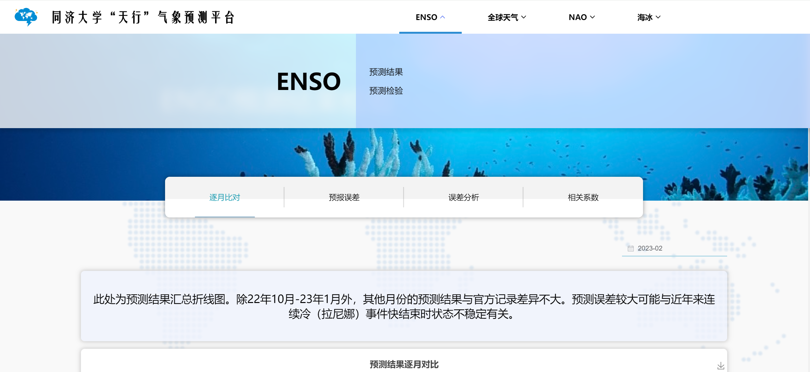
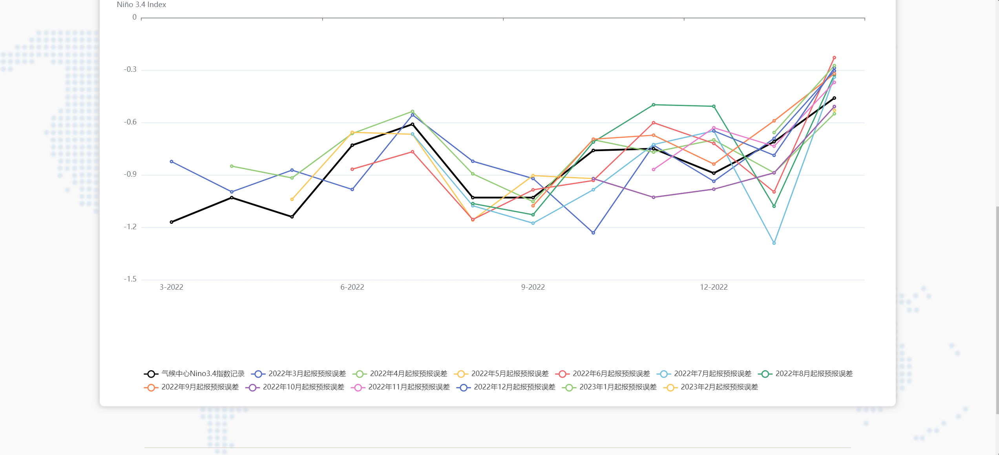
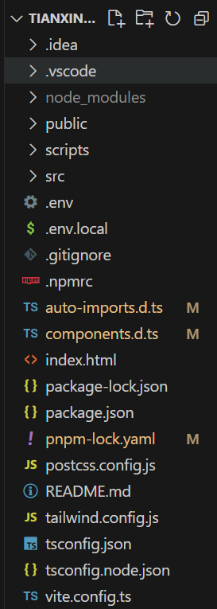
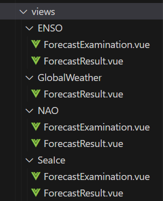
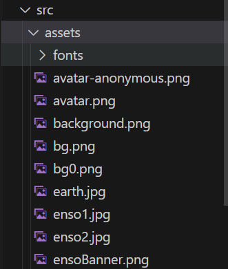

# 同济大学天行气象预测平台

7月22日至8月16日，共计4周。

7.29完成基本的页面迁移。

8.10整个项目需要完成，以便后面给老师看。

## 分工

### NAO+海冰

负责人：沈天宇

指导人：顾洪洲

成员：许文涵、李明哲(组长)、程翔宇

### ENSO+全球天气预报

负责人：陈宇轩

指导人：蒋勇

成员：丁宇轩、冯伟航(组长)、王若豪

丁宇轩负责enso的预测检验部分（4个表），王若豪负责全球天气+enso的预测结果部分（3+2个表）

## 相关链接汇总

旧版天行网站：https://tianxing.tongji.edu.cn/

旧版天行网站前端代码：https://github.com/Ultrasty/TianXing-Frontend

旧版天行网站后端代码：https://github.com/fxsgithub/TianXing-Backend

新版天行网站：本仓库

开发目标：https://cemc.cma.cn/intro.html?idx=3

## 环境依赖
1. Nodejs v18或更高
2. 启用 [Corepack](https://nodejs.cn/api/corepack.html) 或者安装 pnpm@8.15.4

## 安装依赖
> pnpm install

## 本地调试
> pnpm dev

## 打包部署
> 打包产物 `dist.zip`
```shell
pnpm build
```

## 项目结构
天行网站前端代码：https://github.com/Ultrasty/tianxing2024
天行网站界面示例：



运行pnpm install后，代码目录如下：


项目维护的主要代码在./src目录中，具体如下：


其中ENSO、全球天气、NAO、海冰四个板块代码分别储存在./src/views目录下的ENSO、GlobalWeather、NAO、Seaice四个目录中，目前全球天气板块仅有预测结果模块，其余三个板块均分为预测结果模块和预测结果检验模块，其代码分别在ForecastExamination.vue和ForecastResult.vue文件中。


所有网站图片放置在./src/assets目录下


所有网页路径放置在./src/router/index.ts文件中，添加新样式页面时需要在此文件中添加相应的路径。

各级菜单存放在./src/router/HeaderView.vue的menus数组中，添加各级菜单时需要在此添加。

## 维护方法
## 一、添加一个顶栏项目

### 1. 添加页面路径
创建顶栏项目时，首先创建好页面样式并存储在.vue文件中，然后在 `index.ts`（./src/router）的router数组中添加对应页面的路径。以下为添加`Typhoon.vue`(假设目录为./src/views)路径到`index.ts`的示例：
```javascript
//其他import...
import Typhoon from '@/views/Typhoon.vue'; //导入新页面

const router = createRouter({
    history: createWebHashHistory('/tianxing'),
    routes: [
        {
            name: 'home',
            path: '/',
            component: UserView,
            redirect: { name: 'ENSO_ForecastExamination' }, //默认首页
            children: [
                // 其他页面路径...
                {
                    name: 'NAO_ForecastExamination',
                    meta: {
                        title: 'NAO_ForecastExamination',
                    },
                    path: 'NAO_ForecastExamination',
                    component: NAOForecastExamination,
                }
                { //新添加的页面路径
                    name: 'Typhoon',
                    meta: {
                        title: 'Typhoon',
                    },
                    path: 'Typhoon',
                    component: Typhoon,
                }
            ],
        },
    ],
})
```

### 2. 更新 menus 数据
在 `HeaderView.vue` （./src/views/user）中找到 `menus` 数组并在其中添加新的列表作为新的板块。以下为添加一个“台风”板块的示例：
```javascript
const menus = ref([
  // 其他菜单项...
  {
    title: '海冰',
    name: 'SeaIce',
    subMenus: [
      { title: '预测结果', name: 'SeaIce_ForecastResult' },
      { title: '预测检验', name: 'SeaIce_ForecastExamination' },
    ],
    offsetLeft: 0
  },
  { //以下为新添加的板块
    title: '台风', //板块名称
    name: 'Typhoon', //板块标识符
    subMenus: [
      { title: '二级菜单1名称', name: '二级菜单1标识符' }, //此处按格式添加二级菜单
    ],
    offsetLeft: 0 //偏移量，初始要置0
  },
]);
```

### 3. 测试
在浏览器中查看更改，确保顶栏中已加入新的板块

## 二、增加一个二级菜单

### 1.添加页面路径
创建好页面样式并存储在.vue文件中，然后在 `index.ts`（./src/router）的router数组中添加对应页面的路径。（具体方法参考上述“添加一个顶栏项目”步骤1）

### 2.更新 subMenus 数据

在 `HeaderView.vue` （./src/views/user）中找到 `menus` 数组并在相应的菜单对象的 `subMenus` 数组中添加新的对象。例如，如果你想在“全球天气”菜单下添加一个名为“气候分析”的新二级菜单项：

```javascript
const menus = ref([
  {
    title: 'ENSO',
    name: 'ENSO',
    subMenus: [
      { title: '预测结果', name: 'ENSO_ForecastResult' },
      { title: '预测检验', name: 'ENSO_ForecastExamination' },
    ],
    offsetLeft: 0
  },
  {
    title: '全球天气',
    name: 'GlobalWeather',
    subMenus: [
      { title: '预测结果', name: 'GlobalWeather_ForecastResult' },
      { title: '气候分析', name: 'GlobalWeather_ClimateAnalysis' }  // 新添加的二级菜单项
    ],
    offsetLeft: 0
  },
  // 其他菜单项...
]);
```

### 3.确保模板可以渲染新的菜单项

由于我们先前已经使用了 `v-for` 指令来渲染 `subMenus` 数组中的每个项，新添加的菜单项将自动显示在下拉菜单中。确保你的`HeaderView.vue`模板部分看起来类似于以下代码，这样新的菜单项就会正确显示：

```html
<template>
  <div class="header-container" v-show="isHeaderVisible">
    <div class="header-content">
      <router-link :to="{ name: 'home' }" class="logo-container">
        
        
        
      </router-link>
      <div class="nav-wrapper">
        <div class="nav-items">
          <div v-for="menu in menus" :key="menu.name" @mouseenter="handleMouseEnterNavItem(menu, $event)"
            @mouseleave="handleMouseLeaveNavItem" class="nav-item" :class="{ active: isActive(menu.name) }">
            <DropdownMenu :title="menu.title" :subMenus="menu.subMenus" :isVisible="nav_item_selected === menu.name"
              :style="{ left: menu.offsetLeft + 'px', zIndex: -10 }" />
            <span class="menu-title">{{ menu.title }}</span>
            <span class="v-icon" :class="{ 'rotate': nav_item_selected === menu.name }"><svg ...></svg></span>
          </div>
        </div>
      </div>
    </div>
  </div>
</template>
```

### 测试
在浏览器中查看更改，确保新的二级菜单项显示并且能正确导航到相应的路由。

## 三、增加一个 tab（三级菜单）

### 以`ForecastExamination.vue`（./src/views/Seaice）为例

### 1. 更新数据模型
首先，你需要在 `chartNames` 数组中添加一个新的图表名称，这个数组定义了所有 tab 的标签。此外，还需要为新的 tab 准备相关的数据和图表配置。
```javascript
const chartNames = ref(['SIC日预测误差', 'SIC误差统计', 'SIE误差分析', '新的Tab名称']);

// 假设为新Tab准备的响应数据和配置
const newTabDescription = ref('这里是新Tab的描述。');
const newTabOption = ref({});  // 假设这是新Tab的图表配置
```

**具体写法以及命名请参考以下代码**
```javascript
const chartTitle = ref('')
chartTitle.value = `${selectedYear.value}年${selectedMonth.value}月 预测结果误差折线图`
//chartTitle.value = `2023年1月预测结果误差折线图`


const chartTitle2 = ref('')
chartTitle2.value = `${selectedYear.value}年${selectedMonth.value}月~${Number(selectedYear.value) + 1 + ''}年${selectedMonth.value}月 预测结果误差折线图`

const chartTitle3 = ref('')
chartTitle3.value = `${selectedYear.value}年SIC回报结果误差箱型图`

const chartTitle4 = ref('')
chartTitle4.value = `SIE预测误差分析`

const option1 = ref({})
const option2 = ref({})
const option3 = ref({})
const option4 = ref({})
const option5 = ref({})
const option6 = ref({})
const option7 = ref({})
```

### 2. 逻辑处理

你需要在 selectChart 函数中添加对新 tab 的处理逻辑，以确保当用户选择这个 tab 时，加载正确的数据和更新界面。
```javascript
function selectChart(index) {
  chartSelected.value = index;
  switch (index) {
    case 0:
      // 已有逻辑
      break;
    case 1:
      // 已有逻辑
      break;
    case 2:
      // 已有逻辑
      break;
    case 3:  // 新的Tab索引
      // 例如加载新的Tab数据
      loadNewTabData();
      break;
  }
}

// 加载新Tab数据的函数
function loadNewTabData() {
  // 假设通过API获取数据
  axios.get('/path/to/your/new/tab/data')
    .then(response => {
      newTabDescription.value = '更新的描述';
      newTabOption.value = response.data.chartOption;
    })
    .catch(error => console.error('加载新Tab数据失败:', error));
}
```

### 3. 模板标记更新
在 Vue 的模板部分，你需要添加相应的显示逻辑来展示新 tab 的内容。

```html
<div v-if="chartSelected === 3" class="chart-selector">
  <div class="description">
    {{ newTabDescription }}
  </div>
  <v-chart :option="newTabOption" autoresize></v-chart>
</div>
```

### 4. 添加样式
根据需要，你可以添加或调整 CSS 来适应新 tab 的样式需求。
